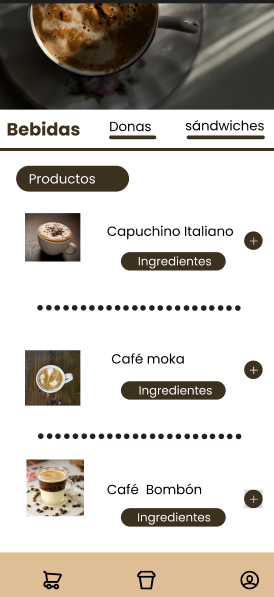
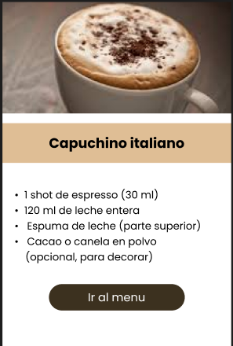

## Planteamiento del problema
_____________________________
En la cafetería en sí se presentan dificultades como la atención al cliente, ya que al tomar los pedidos se generan errores en la toma de aquellos pedidos, como agregar productos que no solicita el cliente o cantidades equivocadas, haciendo que el cliente quede insatisfecho con su pedido, además de las largas filas que se generan por la falta de registrar y realizar los pedidos, generando la demora de atención. 

Para eso se requiere un sistema de pedidos en el cual se lleve un control adecuado de las ventas y una mejor organización y eficiencia en el servicio. 

## Objetivos generales
__________________

El objetivo para este programa es mejorar la gestión de pedidos de cafetería para el cliente, para que esté satisfecho con su encomienda.

## Objetivos específicos
_________________________

- Reducir las filas y el tiempo de toma de los pedidos de los clientes. 
-	Minimizar los errores de las tomas de pedidos, como los productos y cantidades incorrectas
- Facilitar el uso del sistema para aquellas personas que lo van a usar como aprendices, instructores y personas del cafetín. 

## Alcance 

### (Lo que incluye) 
-	La idea del sistema es estar orientado a la atención de la cafetería, mejorando el registro de los pedidos realizados por los clientes de forma ordenada, para así evitar los errores ya comentados, que son reducir errores de productos y cantidades. 

### (Lo que no incluye) 
-	Por ahora no incluye la gestión de inventario 
-	Pagos por línea ni reportes financieros

______________________

## Requerimientos Funcionales
-  RF1. El sistema debe permitir al usuario visualizar los productos disponibles.
- 	RF2. El sistema debe permitir al usuario agregar productos a un carrito y modificar sus cantidades.
- 	RF3. El sistema debe permitir al usuario confirmar el pedido antes de enviarlo.
- 	RF4. El sistema debe permitir al personal del cafetín recibir y visualizar los pedidos confirmados.
- RF5. El sistema debe permitir al personal del cafetín marcar los pedidos como preparados y entregados.

________________

## Requerimientos no Funcionales

-  RN1. El sistema debe ser fácil de usar para aprendices, instructores y personal del cafetín.
- RN2. El sistema debe permitir una toma de pedidos rápida para reducir filas y tiempos de espera.
- RN3. El sistema debe mostrar la información de los pedidos de forma clara y ordenada.
_____________________

 ## Reglas de negocio
- 	RN1. Todo pedido debe ser confirmado por el usuario antes de ser procesado.
- 	RN2. Un pedido debe contener al menos un producto para poder registrarse.
-	RN3. Los pedidos deben ser atendidos en el orden en que fueron recibidos.
___________

## Priorización MoSCoW
-	visualizar los productos disponibles. (Must) (Debe tener)
-	 Agregar productos a un carrito y modificar sus cantidades (Must) (Debe tener)
-	Confirmar los pedidos que se van a pedir antes de enviarlos (Must) (Debe tener)
-	 Visualizar aquellos productos confirmados (Must) (Debe tener)
-	Que el personal pueda marcar los pedidos como preparados o entregados (Should) (Debería tener)

______________________________

## Mockup inicial (baja fidelidad)
____________
Las pantallas de este sistema son: 

> Página Principal / Menú de Productos

> Pagina de ingredientes del producto

- Página del Carrito ( ver y eliminar el producto)

- Página de Confirmación del Pedido

- Panel del Personal del Cafetín (Pedidos Recibidos)
- Panel de Estado del Pedido

https://www.figma.com/design/1fpIGDsgrtVghoMde5FMxx/CAFETERIA?node-id=0-1&t=5OVGKReLjxJxdcvN-1

_________________

## Backlog / Plan de trabajo
_______________________

### Historial de Usuario

#### HU1 - Visualizar productos

> Como usuario, quiero ver los productos disponibles para así elegir lo que quiero compara

### Criterios de aceptación:
- Se muestran todos los productos disponibles.

- Cada producto tiene nombre y precio.

- Existe un botón para agregar al carrito.

#### HU2 – Agregar productos al carrito

> Como usuario, quiero agregar productos al carrito para poder realizar un pedido.
### Criterios de aceptación:

-  El usuario puede agregar uno o más productos.
- El carrito muestra los productos agregados.
- Se puede eliminar un producto.

#### HU3 – Confirmar pedido

>Como usuario, quiero confirmar mi pedido antes de enviarlo para asegurar que sea correcto.

### Criterios de aceptación:
- Se muestra un resumen del pedido.
- El usuario debe presionar “Confirmar pedido”.

#### HU4 – Visualizar pedidos (Personal)

> Como Personal,  quiero visualizar los pedidos confirmados para poder prepararlos.

### Criterios de aceptación:

- Se muestran solo pedidos confirmados.

#### HU5 – Cambiar estado del pedido
> Como personal,  quiero marcar los pedidos como preparados y entregados. 

### Criterios de aceptación:

- El pedido puede cambiar de estado (Pendiente → Preparado → Entregado).

- El sistema actualiza el estado correctamente.

- El estado se muestra claramente.

### Priorizacion 

> Alta // HU1, HU2, HU3

> Media // HU4, HU5

### Estimación

> HU1 -- 1 día

> HU2 -- 2 día 

> HU3 --  1 día

> HU4 -- 2 día

> HU5 -- 1 día

________________

## Modelo de datos (propuesto)

Entidades : 

### Usuario 
- id_usuario (PK)
- nombre
- rol 
_________
#### Producto 
- id_producto (PK)
- nombre
- precio
- cantidad 
_____
#### Ingrediente
- id_ingrediente (PK)
- nombre
_____
#### Producto_Ingrediente (Pivote) 
- id_producto_ingrediente (PK)
- id_producto (FK)
- id_ingrediente (FK)

____

#### pedido
- id_pedido (PK)
- id_usuario (FK)
- fecha 
- estado (Pendiente → Preparado → Entregado).
- total 

________

#### Producto_pedido
 (  es el detalle de la cantidad de productos tomados en cada pedido )
- id_detalle (PK)
- id_pedido (FK)
- id_producto (FK)
- cantidad
- subtotal

